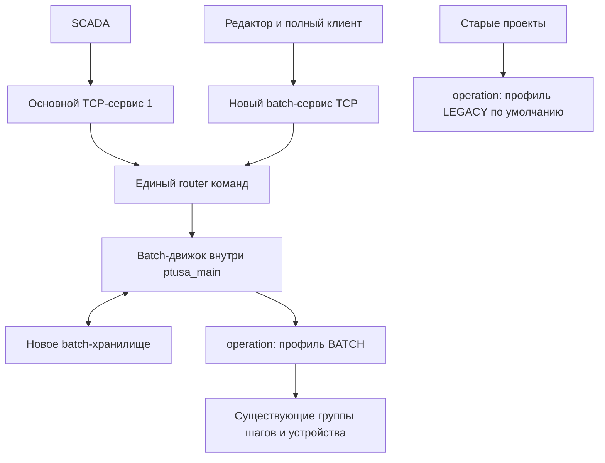
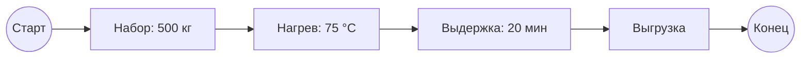

# План встроенного batch-сервера ptusa_main

Редакция 2, 2026-10-02. Статус: проектирование; исполняемый код не изменён.

## 1. Зафиксированная архитектура

Граф batch-рецепта исполняется внутри ptusa_main. SCADA и редактор управляют одним локальным движком через существующий TCP-протокол. Основной сервис предоставляет отображение логики и минимальные команды, отдельный batch-сервис — полный интерфейс управления. Отдельный service ID не означает новый процесс или порт. OPC UA для batch не используется.

Существующая operation получает профиль исполнения LEGACY/BATCH. По умолчанию LEGACY сохраняет текущие алгоритмы, команды и форматы. Для выбранных операций новая политика переходов использует те же технологические шаги. Новые рецепты, параметры партии, журнал и восстановление хранятся отдельными механизмами; существующие рецептурные классы и файлы остаются.

Новая политика оформляется отдельным классом, подключённым к operation. Над ней не работает второй независимый фазовый автомат: в каждый момент действует ровно один профиль. Отдельные классы нужны для графа, ресурсов, параметров, хранения и интерфейсов.

Это ограниченная доработка существующей машины состояний, но не изменение одного switch: с состояниями связаны команды, автоматическое завершение, таймеры, шаги, Lua-хуки и сериализация.



Закрытие редактора или потеря связи с SCADA не останавливает локальный граф. Локальные технологические ошибки и заданная политика потери операторского контроля продолжают действовать. Первая версия управляет объектами одного PAC; межконтроллерная оркестрация требует отдельного проекта.

## 2. Что подтверждено исходниками

| Файл/метод | Факт | Следствие |
|---|---|---|
| operation_mngr.h, operation::state_idx | IDLE=0, RUN=1, PAUSE=2, STOP=3, STARTING=10, затем PAUSING, UNPAUSING, STOPPING, COMPLETING | Сохранить старые числа и индексы групп |
| operation::evaluate() | Выполнение группы и выбор перехода объединены | Добавить диспетчеризацию профиля |
| operation::pause/start/stop() | Повторная команда в переходном состоянии может досрочно завершить переход | В LEGACY оставить; в BATCH сделать команды идемпотентными |
| operation::finalize/switch_off() | Переводят операцию в IDLE | Для BATCH разделить выключение, завершение и RESET |
| operation_state::evaluate() | Последний шаг по времени вызывает operation_manager::off_mode() | Добавить событие с причиной завершения и ролью группы |
| operation::active_step/evaluation_time/to_step/... | Индексируют группы через current_state | Проверить все методы доступа, не только evaluate |
| tech_object::set_mode() | Проверяет команды и вызывает Lua-хуки; неизвестное ненулевое значение нормализует в запуск | Новые команды нельзя передавать туда как новые числовые состояния |
| tech_object::evaluate() | При ошибках может напрямую вызвать op->pause() | Прямые вызовы тоже должны учитывать профиль |
| tech_object::save_device() | Выдаёт ST, MODES, OPERATIONS, время и шаги | Полное batch-состояние передавать отдельно от старых полей |
| tcp_cmctr.h | reg_service и 16 слотов сервисов | Новый API регистрируется на текущем транспорте |
| common/lua_manager.cpp | Сервисы 1 — основной, 2 — debugger, 15 — Modbus | №3 — кандидат после проверки внешних расширений |
| common/PAC-driver/g_device.cpp | Lua-представление данных, сжатие, исполнение Lua-команд либо __RECMAN | Для batch добавить структурированные запросы |
| tcp_cmctr.cpp и Windows/Linux реализации | Длина payload двухбайтовая, pidx однобайтовый | Нужны порционные документы и собственный command_id |
| params_recipe_manager.cpp | loadParams пишет в par_float и вызывает save_all | Не использовать как транзакцию нового batch-хранилища |

Проверены main_cycle.cpp и места существующих тестов. Поведение реального SCADA-драйвера и Lua-модулей пилотного объекта ещё нужно проверить.

## 3. Переключаемый профиль operation

Предлагаемый интерфейс, не готовый код:

```cpp
enum class execution_profile { legacy, batch };

class operation {
    execution_profile profile = execution_profile::legacy;
    std::unique_ptr<batch_operation_policy> batch_policy;
    // Прежние шаги, параметры, таймеры и legacy-поля сохраняются.
};
```

В первой реализации оставить существующую legacy-ветку на месте. В необходимых entry points добавить раннее делегирование новой политике при profile==batch. Не переносить сразу весь текущий код в новую иерархию стратегий; это увеличивает объём регрессионной проверки без необходимости.

batch_operation_policy содержит полное состояние BATCH-фазы и правила переходов. operation остаётся единственным технологическим исполнителем. Старые getters в BATCH возвращают документированную проекцию состояния; отдельный новый API — полный phase_state. Проекция не управляет автоматом.

Разделить профиль исполнения LEGACY/BATCH и источник управления Local/SCADA/Batch. Передача управления оператору не переключает активную операцию на старую семантику: оператор управляет той же BATCH-фазой.

Профиль задаётся отдельной конфигурацией по объекту/операции. Без конфигурации — LEGACY. Повреждённая явно выбранная BATCH-конфигурация блокирует запуск этой операции, а не вызывает скрытый fallback. Остальные объекты продолжают работать.

Менять профиль можно только в подтверждённом IDLE, без активных/дополнительных шагов, владельца партии и незавершённых команд. В MVP профиль применяется при загрузке проекта; работающая фаза не переключается. COMPLETE/ABORTED сначала проходят разрешённый RESET.

## 4. Повторное использование групп шагов

Состояние фазы, команда и индекс группы шагов — разные сущности. Новое batch::phase_state независимо от operation::state_idx. Прежние индексы не перенумеровываются.

| Роль/состояние BATCH | Группа/исполнитель | Условия |
|---|---|---|
| STARTING | STARTING | Подтверждённая подготовка |
| RUNNING | RUN | Существующий технологический алгоритм |
| HOLDING | PAUSING | Если группа действительно выполняет нужное удержание |
| HELD | PAUSE | Поддержание и подтверждение постусловий |
| RESTARTING | UNPAUSING | Восстановление шага и повторные проверки |
| STOPPING | STOPPING | Штатная остановка |
| STOPPED | STOP | Без legacy-автоперехода STOP→IDLE |
| COMPLETING | COMPLETING или отдельная группа | Финальные действия после успешного RUN |
| COMPLETE | Терминальный контекст | Защёлкнутый результат до RESET |
| ABORTING/ABORTED | Новые группы/обработчики | Универсального старого аналога нет |
| RESETTING | Новая группа либо проверенный пустой переход | Освобождение и готовность нового запуска |

Дополнительные группы хранить в расширении BATCH-профиля, переиспользуя operation_state, где это подходит. Не индексировать старый массив числом нового фазового состояния.

Ввести внутренний доступ к фактической активной группе для evaluate, времени, шагов, to_step, дополнительных шагов. LEGACY выбирает прежнюю states[current_state], BATCH — группу своей роли. Пройти все места, использующие current_state.

Проекция для старого API использует только прежние коды: RUNNING→RUN, HELD→PAUSE, STARTING→STARTING и т.п. Терминальные состояния до RESET можно проецировать в STOP только после проверки клиентов. Полный смысл доступен в BATCH_STATE. Проверка занятости опирается на полный контекст и владельца, а не только на проекцию.

При отключённом batch старые поля выдаются как прежде. При включённом новая семантика требует аудита Lua-автопереходов: одна проекция не гарантирует совместимость произвольного старого скрипта.

## 5. Завершение и аварии

Выделить событие sequence_finished(operation_id, execution_role, cause, instance_id, sequence_id). В точке окончания последнего шага:

- LEGACY выполняет прежнее выключение с теми же сообщениями и хуками.
- BATCH передаёт результат конкретной группы новой политике.

Окончание RUN может начать COMPLETING. Окончание HOLDING подтверждает удержание только вместе с постусловиями. Завершение STOPPING/ABORTING не является успехом всей фазы. Не считать любой off_mode/set_mode(op,0) событием COMPLETE.

Для завершения из Lua или нестандартных алгоритмов нужен явный report_complete либо однозначный предикат с защёлкиванием результата текущего запуска. Неоднозначные операции нельзя использовать для автоматического продвижения рецепта.

Событие из evaluate группы защёлкивается; переход выполняется на безопасной границе, без рекурсивной финализации активной группы. В LEGACY порядок callbacks не меняется. Для BATCH явно описать init/final/on_start/on_pause/on_stop и обеспечить один вызов на соответствующее событие.

Профиль BATCH: IDLE, STARTING, RUNNING, HOLDING, HELD, RESTARTING, STOPPING, STOPPED, COMPLETING, COMPLETE, ABORTING, ABORTED, RESETTING. Команды START/HOLD/RESTART/STOP/ABORT/RESET типизированы. Числовые IDs — версионированный контракт проекта, не старые индексы.

Квитанция содержит phase_instance_id и directive_seq. Повторная команда не вызывает повторный старт и не пропускает переходную группу. Разделить execution_complete (RUN закончен) и complete_done (финальные действия закончены). COMPLETE/STOPPED/ABORTED сохраняются до RESET. После COMPLETE следующему узлу разрешается старт по графу; STOP после успеха не нужен.

Fault_Class 0/2/3 можно оставить как проектный контракт. Дополнительно хранить fault_id, источник, время, активность и квитирование. Авария имеет приоритет над штатным завершением; Abort сильнее Hold. Таймаут не является успешной квитанцией, квитирование ошибки не означает RESTART.

ABORT требует реального алгоритма оборудования. Изменение enum не создаёт аварийный слив/сброс давления. Возможности каждой фазы фиксируются в binding; неподдерживаемые требования рецепта отклоняются валидатором.

## 6. Команды объекта

Добавить типизированный tech_object::submit_batch_command(op, context) с проверкой профиля, владения, состояния, параметров и готовности. Существующие проверки оборудования и Lua-хуки переиспользуются; прямой вызов policy из сети недопустим.

Старый set_mode для LEGACY остаётся прежним. Для BATCH значения 0/1/2/3 проходят явную таблицу совместимости. 0 означает запрос выключения/остановки по заданной политике, а не успех и не скрытый RESET. Неоднозначная команда отклоняется. Новые числовые коды нельзя пропускать в legacy default, который трактует их как запуск.

Прямые op->pause/stop/start/finalize, дополнительные шаги и Lua-переходы тоже учитывают профиль. Синхронизация битов активности tech_object с полным BATCH-контекстом выполняется в одном месте; терминальный результат до RESET не даёт случайно занять аппарат другой партии.

Оба сервиса используют один batch_command_router, очередь, проверки владения и дедупликацию по клиенту/сессии и command_id. Местные защитные действия сохраняют приоритет. Переключение Local/Batch — явная передача управления с событием, не смена автомата.

Одним guard в set_mode нельзя исключить прямые Lua-записи параметров/устройств. На пилоте составить перечень писателей, запретить конфликтующие автостарты и согласовать ручные пути управления. Старые restrictions продолжают действовать.

## 7. Основной сервис для SCADA

Сохранить service ID=1, прежние команды и данные. Добавить batch_scada_view с компактным snapshot:

- версия API/capabilities, batch_id, recipe_id/revision, graph_revision;
- общий статус, владелец, режим управления, причина ожидания;
- активные node_id/phase_instance_id, аппарат, операция, текущий legacy-шаг;
- BATCH_STATE, время, Fault ID/Class, качество/свежесть;
- допустимые команды, state_revision, статус последнего запроса.

Для отображения логики нужны узлы и связи, не только активный node_id. Основной сервис предоставляет компактную схему опубликованного рецепта по запросу/ревизии. SCADA кэширует граф, циклически читает только snapshot. Большой граф выдаётся страницами, не включается целиком в GET_DEVICES_STATES.

Минимальные команды: запуск заранее опубликованного рецепта с подготовленной формулой, HOLD, RESTART, STOP, ABORT, разрешённый RESET и отдельное квитирование. Доступность определяется состоянием и правами. Редактирование рецепта через минимальный интерфейс не предусматривается.

Предпочтительны новые явные команды сервиса №1: GET_BATCH_SUMMARY, GET_BATCH_GRAPH_PAGE, EXEC_BATCH_COMMAND. Их номера выбираются после аудита общего заголовка драйвера. Добавление компактной BATCH-таблицы в обычную телеметрию допустимо только после проверки поддержки неизвестных полей клиентом. Иначе batch доступен новыми запросами без изменения старого ответа/нумерации устройств.

В исходниках основной протокол версии 104. Не менять её автоматически; batch API имеет собственную версию. Необходимость изменения общего handshake определяется реальной совместимостью драйвера.

Новые рецепты не исполняются как Lua-строки через CMD_EXEC_DEVICE_COMMAND. Если старому драйверу нужен вызов минимальной команды из Lua, предоставить узкий типизированный мост к тому же router, без отдельных правил исполнения.

## 8. Отдельный batch-сервис текущего TCP-протокола

Добавить batch_communicator::process_service(long len, u_char* data, u_char* outdata), зарегистрировать через G_CMMCTR->reg_service. №3 предварительно свободен в исследованной конфигурации; проверить внешние расширения, диапазон и коллизию. reg_service возвращает прежний обработчик при занятом ID.

Полный API: capabilities/лимиты, каталог оборудования, bindings, чтение/загрузка/валидация/публикация рецептов, подготовка и управление партиями, полный snapshot, события/история, ресурсы и восстановление. Активация новой конфигурации разрешена только на безопасной границе.

Сохранить TCP-рамку. Payload нового сервиса имеет собственную версионированную схему: например явный заголовок и UTF-8 JSON с проверкой схемы. Это формат данных внутри текущего протокола. Не сериализовать C++ long/структуры без явных размеров и порядка байт. В MVP можно обойтись без сжатия: сжатие service 1 не применяется к новому обработчику автоматически.

Контекст: api_version, client_session_id, request_id, command_id, controller_boot_id, ownership_epoch, batch_id, phase_instance_id, expected_revision, parameter_revision, command, payload. request_id связывает ответ, command_id обеспечивает идемпотентность. Тот же command_id с другим содержимым отклоняется. accepted не означает технологически done, транспортный ACK не заменяет результат команды.

Поле длины payload ограничено 65535 байтами, включая служебную часть payload. Буфер 500 KiB этого не меняет. Графы и история передаются порциями с transfer_id/revision/offset и проверкой целостности. Незавершённая загрузка не публикуется. pidx транспорта слишком короткий для долговременной дедупликации.

В существующем вызове сервиса вход и выход перекрываются: buf+6 и buf+5. Запрос нужно разобрать/скопировать до записи ответа; отложенная команда не хранит ссылки на сетевой буфер. Проверять len до чтения, ограничивать ответ до записи: callback не получает capacity отдельно.

Оставить request/response. События читать GET_EVENTS(after_seq,limit), без необъявленного push. Утрата cursor требует полного snapshot. Ограничить страницы и время обработки, чтобы клиент не задерживал скан и опрос SCADA.

Существующий callback не передаёт идентичность socket/пользователя. Для прав/сессий нужен явный прикладной контракт либо дополнительный контекст диспетчера; service ID сам по себе не даёт аутентификации. Ограничения доступа должны учитывать и сохранившийся legacy-путь Lua-команд.

## 9. Новые механизмы хранения

Существующие ParamsRecipeStorage, ParamsRecipeAdapter, файлы рецептов, параметры и NVRAM не менять. Batch получает отдельное пространство хранения; автоматическая миграция не обязательна.

| Данные | Новый механизм |
|---|---|
| Определения рецептов/bindings | batch_definition_store: версии, схема и целостность |
| Формула партии | batch_parameter_store: типизированный snapshot с единицами/revision |
| Исполнение | batch_execution_store: checkpoint партии/фаз/узлов/команд |
| История | batch_event_store: последовательный журнал с sequence |
| Владение | Контекст runtime, boot_id/epoch и данные для сверки |

Исходный вариант backend для PAC: отдельный каталог batch, неизменяемые файлы определений, manifest опубликованных версий, последовательный журнал и контрольные точки. Запись: temporary → проверка → завершённая запись → публикация manifest. Атомарность замены и устойчивость к потере питания проверяются на целевых Windows/Linux/PAC; один rename не доказывает сохранность. Checkpoint имеет поколение/контрольную сумму, восстановление выбирает последнюю валидную запись.

Интерфейсы хранения отделены от файлового backend, чтобы можно было выбрать другой носитель/БД без изменения operation и сетевого API. Определить квоты, retention/экспорт истории, износ носителя, реакцию на заполнение и ошибку записи. Операции хранения не блокируют технологический цикл; START ожидает необходимой фиксации, продолжая вычисление остального оборудования.

Опубликованный рецепт неизменяем. BatchInstance хранит собственный control recipe snapshot; редактирование master recipe не меняет партию. После рестарта нельзя подставить последнюю версию вместо исполнявшейся.

Новое хранилище параметров не меняет автоматически то, откуда старые шаги читают значения. parameter_bridge применяет проверенный полный набор в реально используемые par_float/rt_par_float/... до START и при эксклюзивном владении. Старое постоянное хранилище не перезаписывается без явной политики. Если параметры накладываются временно, описать восстановление в idle, конфликт со старым загрузчиком и сбой питания.

Все значения проверяются до первой записи: тип, диапазон, единицы, наличие параметра и версия binding. В скане не допускается наблюдение частичного набора. При отказе до запуска — восстановление старых значений; после технологического старта слепой откат запрещён. Общая транзакционность аппаратных действий и сторонних Lua-callbacks не обещается.

Позже можно добавить односторонний импорт старого рецепта параметров в новый snapshot. Старый loadParams не является механизмом сохранения batch-рецепта.

## 10. Отдельные классы

| Класс | Назначение |
|---|---|
| operation | Существующий исполнитель с выбором профиля |
| batch_operation_policy | Новые состояния, переходы и квитанции той же operation |
| batch_phase_context | Instance ID, состояние, directive generation, ошибки и результаты |
| operation_execution_binding | Роли групп, Done-предикаты, hooks и capabilities |
| batch_runtime | Локальный жизненный цикл batch и ограниченная pre/post обработка |
| batch_command_router | Единая очередь, проверка/дедупликация команд обоих сервисов |
| batch_scada_view | Компактные snapshot и схема для основного сервиса |
| batch_communicator | Полный API в отдельном сервисе текущего TCP |
| batch_definition_store / parameter_store / execution_store / event_store | Новое хранение по назначению |
| parameter_bridge | Передача формулы в текущие поля технологического исполнителя |
| equipment_catalog / resource_manager | Оборудование, совместимость и владение |
| recipe_validator / recipe_executor | Проверка и локальное исполнение графа |
| batch_instance / unit_procedure_instance / recipe_operation_instance | Контексты партии и процедурных уровней |
| recovery_service | Сверка журнала, фаз, команд и оборудования после рестарта |

Не все имена требуют отдельного исходного файла; разделение отражает ответственность. operation объекта соответствует исполнителю фазы. recipe_operation — операция рецепта из нескольких фаз. Unit — аппарат, BatchInstance — партия.

Вместо двух синхронизируемых машин состояния фазы используется одна BATCH-политика внутри operation. recipe_executor управляет графом и дочерними экземплярами; он не вычисляет их технологические шаги повторно.

## 11. Цикл исполнения

Предлагаемые точки интеграции:

```text
read_inputs → evaluate_io → valve::evaluate
batch_runtime.before_objects(): подготовленные команды/параметры, ограниченный объём
tech_object_manager::evaluate(): C++ объектов и общий Lua eval как прежде
batch_runtime.after_objects(): события фаз, ошибки, продвижение графа в пределах лимита
debugger → write_outputs → communicator → остальная текущая обработка
```

operation вычисляет группы выбранного профиля один раз за цикл. after_objects не вызывает повторный полный evaluate объекта/пользовательского Lua. Следующие START можно ставить на начало следующего скана; пустые узлы графа обрабатываются с ограничением числа переходов. Сетевые callbacks копируют запрос в очередь и возвращают готовый snapshot/accepted, не вызывают технологический алгоритм внутри обслуживания TCP.

Для нового профиля определить безопасную границу применения локального Fault после Lua до write_outputs. Существующая локальная защита продолжает действовать. Многошаговое удержание требует нескольких сканов; его нельзя объявлять HELD по факту подачи команды. Немедленное выключение насоса подтверждается конкретной блокировкой, порядком записей и отсутствием последующей перезаписи выхода.

Парсинг/валидация больших графов, файловая запись и экспорт журнала выполняются вне критической части скана, с ограниченными очередями. Фоновая задача не обращается напрямую к Lua или живым operation: передаёт подготовленные неизменяемые данные, активируемые в потоке PAC. Предусмотреть лимиты графа, партий, фаз, памяти, событий и команд за цикл.

## 12. Владение и восстановление

Для MVP объект резервируется целиком на UnitProcedure. Параллельные фазы разных объектов разрешаются при отсутствии общих ресурсов. Общие насосы, маршруты и линии описываются отдельно; прежние restrictions не заменяются новым менеджером.

Получение нескольких ресурсов упорядочено или выполняется полным набором с таймаутом, без удержания частичной блокировки навсегда. Смена Local/Batch выполняется явно; защитные команды не блокируются владельцем. Истечение heartbeat клиента не освобождает занятый аппарат.

Потеря SCADA/редактора не останавливает автономное исполнение графа в ptusa_main. Если конкретный процесс требует присутствия оператора, отдельная заранее заданная политика запрещает новые опасные действия/выполняет доступное удержание. Универсальный Hold для оборудования без соответствующего алгоритма недопустим.

До действия фиксировать необходимое намерение команды, затем факт принятия и результат. После рестарта сверять boot_id, instance IDs, версию рецепта/параметров и реальное состояние объектов. Новые команды старой клиентской эпохи отклоняются. Не повторять дозировку из-за потерянного ACK.

Физическое exactly-once через потерю питания не гарантируется. Неопределённый результат требует состояния восстановления и решения оператора. В MVP автоматический рестарт партии после перезагрузки PAC выключен. Потеря записи журнала не считается успешным технологическим завершением.

Reload объектов/операций при активной привязке и владении запрещён. Binding содержит устойчивый логический ID и версию конфигурации; не держать бессрочные указатели на operation/step через reload. Обновлять разрешённые привязки только в подтверждённом простое.

## 13. Редактор и представление SCADA

Один декларативный документ используется редактором, валидатором, движком и компактным представлением SCADA. Layout отделён от семантики. Узлы имеют устойчивые IDs; подсветка связывается с node_id+graph_revision, а не с позицией на экране.

Полный редактор: дерево PAC/Unit/фаз, структура Procedure→UnitProcedure→RecipeOperation, граф PhaseCall, параметры/результаты и условия, валидация, публикация, наблюдение. SCADA получает опубликованную схему, состояния, причины ожидания и разрешённые операторские действия.

MVP: Start/End, последовательность фаз, типизированные входы/результаты. Далее условия и структурированный Parallel/Join с join=all, таймаутом и определённой реакцией соседних ветвей на ошибку. Циклы, join=any и параллельность внутри одного объекта отложить.

Пример:



Валидатор проверяет достижимость End, переходы, типы/единицы, capabilities фаз, версии bindings, ресурсные конфликты и определённость результатов. Запущенный рецепт не редактируется на месте. Общий HELD возможен лишь после подтверждения всех необходимых дочерних фаз; выбор другого рецепта не меняет активную партию.

## 14. Точки изменения и этапы реализации

| Место | Изменение |
|---|---|
| PAC/common/operation_mngr.h/.cpp | Профиль, новая политика, активная группа, событие окончания роли |
| PAC/common/tech_def.h/.cpp | Типизированные команды, совместимость, checks/hooks, активность/владение |
| common/PAC-driver/g_device.h/.cpp | Новые ограниченные запросы SCADA, сохранение прежних кодов |
| Новый batch_communicator | Полный сервис текущего TCP; OPCUA файлы не нужны |
| common/lua_manager.cpp | Регистрация и opt-in загрузка профилей после создания объектов |
| PAC_control_projects/main_control_prg/main_cycle.cpp | Ограниченные pre/post hooks |
| Новые batch/*_store | Изолированное хранение |
| Lua API | Явные report/batch-команды при необходимости; исходники биндингов, не ручная правка генерируемого cpp |
| CMakeLists.txt | Явное включение новых вложенных исходников/тестов: текущие GLOB нерекурсивны |

Предлагаемые каталоги: PAC/common/batch для runtime/политики/движка, common/batch_protocol для DTO/кодека, test/batch, docs/batch, отдельный batch_editor. Это составные части локального решения; отдельный daemon batch-сервера не требуется.

Bindings хранятся отдельно: не править генерируемые main.objects.lua/prg.lua вручную. Создание отсутствующего технологического ABORT — отдельная работа над алгоритмом, а не автоматический эффект смены профиля.

Этапы и результаты:

1. **Аудит пилота.** Один аппарат, 2–3 операции, причины завершения, Hold/Stop/Abort, параметры и источники команд. Согласовать SCADA-контракт и лимиты PAC.
2. **Каркас с LEGACY по умолчанию.** Диспетчеризация профиля и групп. Тесты/трассы подтверждают неизменность старых сценариев.
3. **BATCH одной операции.** Жизненный цикл, команды, квитанции, completion hook и локальные ошибки; симулятор без сети.
4. **Хранилище и последовательный движок.** Локальная партия из нескольких фаз, собственная формула, журнал/checkpoint, ресурсы и recovery.
5. **Два интерфейса TCP.** SCADA summary/graph/minimal commands и полный batch-сервис; paging, дедупликация, совместимость драйвера.
6. **Редактор и живой граф.** Создание/публикация/запуск/мониторинг. Затем условия, параллельность и масштабирование.

Первый проверяемый результат: один объект с двумя профилями. В LEGACY трасса не отличается от исходной. В BATCH тот же RUN-алгоритм завершается в COMPLETE и остаётся до RESET. После этого подключаются граф, хранение и сеть.

Календарную оценку давать после аудита пилота: минимальность интеграции зависит от однозначности завершения, Lua-писателей и фактической совместимости SCADA.

## 15. Проверки и критерии приёмки

- Старые тесты operation_mngr, tech_def, main_cycle, params_recipe_manager, g_device, tcp_cmctr проходят с LEGACY по умолчанию; сравнить порядок hooks, шаги, таймеры, команды и выходы эталонных трасс.
- LEGACY и BATCH на разных объектах работают одновременно без влияния друг на друга.
- Переключение профиля при исполнении/владении отклоняется; повреждённая BATCH-конфигурация не вызывает скрытый fallback.
- Проверены все методы с current_state, прямые команды, Lua-переходы и дополнительные шаги.
- Успешный последний RUN-шаг, ручное выключение, fault и окончание STOPPING различаются. Старый Done не подтверждает новый instance.
- Повторные START/HOLD/STOP/RESET через оба сервиса имеют единственный эффект; конфликт клиентов разрешается одним router.
- Новые команды не попадают в legacy default set_mode, отказы проверок видны клиенту.
- Старый SCADA-драйвер работает с прежними запросами; обновлённый читает схему/ревизию/состояния. Обычный опрос не растёт пропорционально полному графу.
- Проверены усечённый/неверный payload, перекрытие сетевых буферов, предельные длины, chunking и коллизия service ID на Windows/Linux.
- Незавершённая загрузка/запись не публикуется. Старые файлы читаются прежними классами.
- Отказ носителя, перезапуск PAC, потеря ACK, смена владельца, reload и рассогласование версий дают определённый исход без повторного дозирования.
- Закрытие SCADA/редактора не прекращает локальный граф; отдельная политика контроля оператора выполняется, если задана.
- Нагрузочный тест подтверждает лимиты времени скана и памяти при опросе SCADA, загрузке рецепта и записи истории.

Сначала unit-тесты policy с подставными часами/исполнителем, затем интеграционные тесты реальных operation/tech_object и TCP, затем сценарии recovery на эмуляторе и технологическая приёмка Hold/Abort на стенде.

Для этой редакции изменён только план, исполняемые тесты не запускались. Выполнено исследование точек интеграции по коду.

## 16. Ориентиры

Модель оборудования/процедур/рецептов ориентирована на [ISA-88](https://www.isa.org/standards-and-publications/isa-standards/isa-88-standards). Пример разделения состояния фазы и технологического кода — [PhaseManager User Manual](https://literature.rockwellautomation.com/idc/groups/literature/documents/um/logix-um001_-en-p.pdf), рассмотренный в предыдущей редакции. Это ориентиры, а не заявление о полном соответствии выбранного профиля стандарту.

Точная таблица переходов, IDs, capabilities и порядок hooks фиксируются отдельной спецификацией перед реализацией. Названия COMPLETE/HELD/ABORTED не заменяют технологических постусловий.
